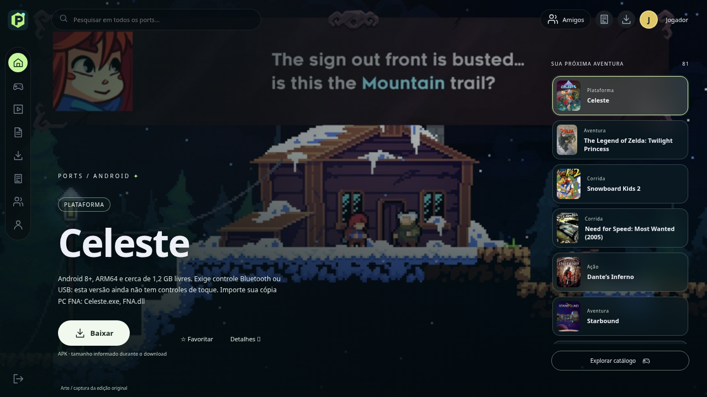

# 🎮 Port Launcher

  <b>Uma experiência renovada para organizar e executar ports no Android.</b>

  

  <b>Android • Game Ports • Launcher</b>

---

## 🚀 Sobre o projeto

**Port Launcher** é um launcher para Android focado em facilitar o acesso e a organização de diferentes ports de jogos em um único lugar.

Este projeto utiliza como base o APK/projeto original **Ports Launcher**, desenvolvido por **Nyaldee**.

A partir dessa base, o projeto foi modificado e expandido com foco em uma experiência melhor no Android, incluindo uma interface renovada e suporte a uma quantidade maior de ports.

> 💜 O objetivo não é apagar o trabalho original, mas continuar desenvolvendo a ideia, preservando os devidos créditos ao projeto que serviu como base.

---

## ✨ Principais mudanças

📱 **Interface renovada para Android**  
A interface recebeu modificações para proporcionar uma experiência mais moderna e adequada ao uso em dispositivos móveis.

🎮 **Mais ports disponíveis**  
O catálogo foi expandido para permitir que mais jogos e projetos possam ser utilizados através do launcher.

🕹️ **Experiência centralizada**  
A proposta é manter diferentes ports acessíveis através de uma única interface.

⚡ **Navegação simplificada**  
Organização da interface e dos elementos do launcher para tornar o acesso aos jogos mais direto.

🔧 **Projeto em desenvolvimento**  
Novas melhorias, correções e ports poderão ser adicionados conforme o desenvolvimento continuar.

---

## 📸 Preview — v1.5

  

  <i>Tela inicial do Port Launcher v1.5.</i>

---

## 🎯 Objetivos

O desenvolvimento do Port Launcher busca:

- 🎮 aumentar gradualmente a quantidade de ports disponíveis;
- 📱 melhorar cada vez mais a experiência no Android;
- 🎨 desenvolver uma identidade visual própria;
- 🧭 manter a navegação simples e organizada;
- ⚡ melhorar estabilidade e desempenho;
- 🛠️ facilitar futuras atualizações e manutenção;
- 💜 preservar os créditos dos projetos utilizados como base.

---

## 📦 Ports

O Port Launcher foi pensado para reunir diferentes projetos e ports em uma experiência centralizada.

A disponibilidade e compatibilidade de cada jogo podem variar conforme:

- dispositivo;
- versão do Android;
- arquitetura do processador;
- requisitos específicos de cada port;
- arquivos adicionais exigidos pelo respectivo projeto.

> Alguns ports podem exigir arquivos originais do jogo que não são distribuídos pelo launcher.

---

## 📱 Compatibilidade

O projeto é desenvolvido com foco em **Android**.

O funcionamento de determinados ports pode variar dependendo do hardware e software do dispositivo.

Dispositivos diferentes podem apresentar diferenças de:

- desempenho;
- compatibilidade gráfica;
- controles;
- áudio;
- estabilidade.

---

## 🛠️ Desenvolvimento

O projeto continuará recebendo melhorias conforme novas versões forem desenvolvidas.

Entre as áreas que poderão evoluir estão:

- interface;
- organização da biblioteca;
- suporte a novos ports;
- compatibilidade;
- controles;
- desempenho;
- correções de bugs.

---

## 🤝 Projeto base

Este projeto foi desenvolvido utilizando como base o:

### Ports Launcher — Nyaldee

Projeto original:

https://github.com/Nyaldee/Ports-Launcher

Uma parte importante da estrutura inicial deste projeto deriva desse trabalho.

Todos os créditos correspondentes ao projeto original e aos seus respectivos autores devem ser preservados.

---

## ⚖️ Aviso

O **Port Launcher** é um projeto independente.

Os jogos, marcas, nomes, personagens e demais propriedades intelectuais mencionados pertencem aos seus respectivos proprietários.

O launcher não concede direitos sobre jogos comerciais e não substitui a necessidade de possuir legalmente os arquivos exigidos por cada port.

Cada projeto integrado também pode possuir sua própria licença, créditos e requisitos de distribuição.

---

## 💜 Port Launcher

  Feito para tornar a experiência com ports no Android mais simples, organizada e acessível.

  🎮 <b>Mais ports. Uma interface. Android.</b>

